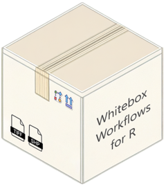
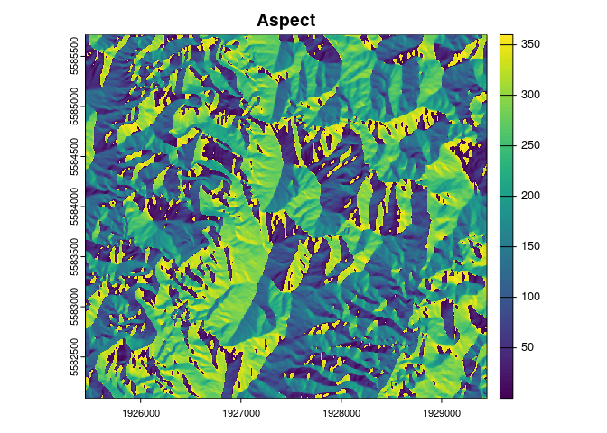

<!-- Don't forget to update pkgdown/index.md -->

# Whitebox Workflows for R `{wbw}` 

<!-- badges: start -->
[](https://www.repostatus.org/#wip)
[](https://github.com/atsyplenkov/wbw/issues/1)
[](https://github.com/atsyplenkov/wbw/actions/workflows/R-CMD-check.yaml)
[](https://app.codecov.io/gh/atsyplenkov/wbw)

<!-- badges: end -->

---
<div align="center">
<a href="https://wbw.anatolii.nz/articles/FAQ.html"><big><b>FAQ</b></big></a> ◽ <a href="https://wbw.anatolii.nz/articles/tutorials.html"><big><b>Tutorials</b></big></a> ◽ <a href="https://wbw.anatolii.nz/articles/benchmarks.html"><big><b>Benchmarks</b></big></a> ◽ <a href="https://github.com/atsyplenkov/wbw?tab=readme-ov-file#installation"><big><b>Installation</b></big></a>
</div>

---

> [!NOTE]
> `{wbw}` is currently in alpha. Expect breaking changes both in the API and in outputs.

The `{wbw}` R package provides R bindings to the [Whitebox Workflows for Python](https://www.whiteboxgeo.com/manual/wbw-user-manual/book/preface.html) — a powerful and fast library for advanced geoprocessing, with focus on hydrological, geomorphometric and remote sensing analysis of raster, vector and LiDAR data.

## Basic workflow

The `{wbw}` R package introduces several new S7 classes, including
`WhiteboxRaster` and `WhiteboxVector` which serves as a bridge between
Python and R.

``` r
library(wbw)

raster_path <- system.file("extdata/dem.tif", package = "wbw")
dem <- wbw_read_raster(raster_path)
dem
#> +------------------------------------------+ 
#> | WhiteboxRaster                           |
#> | dem.tif                                  |
#> |..........................................| 
#> | bands       : 1                          |
#> | dimensions  : 726, 800  (nrow, ncol)     |
#> | resolution  : 5.002392, 5.000243  (x, y) |
#> | EPSG        : 2193  (Linear_Meter)       |
#> | min value   : 63.698193                  |
#> | max value   : 361.020721                 |
#> +------------------------------------------+
```

The true power of `{wbw}` unleashes when there’s a need to run several
operations sequentially, i.e., in a pipeline. Unlike the original
Whitebox Tools, WbW [stores files in
memory](https://www.whiteboxgeo.com/manual/wbw-user-manual/book/introduction.html#how-does-wbw-compare-with-related-whitebox-products),
reducing the amount of intermediate I/O operations.

For example, a DEM can be smoothed (or filtered), and then the slope can
be estimated as follows:

``` r
dem |>
  wbw_mean_filter() |> 
  wbw_slope(units = "d")
#> +------------------------------------------+ 
#> | WhiteboxRaster                           |
#> | Slope (degrees)                          |
#> |..........................................| 
#> | bands       : 1                          |
#> | dimensions  : 726, 800  (nrow, ncol)     |
#> | resolution  : 5.002392, 5.000243  (x, y) |
#> | EPSG        : 2193  (Linear_Meter)       |
#> | min value   : 0.005972                   |
#> | max value   : 50.069439                  |
#> +------------------------------------------+
```

## Yet Another RSpatial Package? Why?

The above example may remind you of the `{terra}` package, and it is not
a coincidence. The `{wbw}` package is designed to be fully compatible
with `{terra}`, and the conversion between `WhiteboxRaster` and
`SpatRaster` objects happens in milliseconds (well, depending on the
raster size, of course).

``` r
library(terra)

wbw_read_raster(raster_path) |> 
  wbw_gaussian_filter(sigma = 1.5) |> 
  wbw_aspect() |> 
  as_rast() |> # Conversion to SpatRaster
  plot(main = "Aspect")
```



The `{wbw}` package is quite fast; you can see the benchmarks [here](https://wbw.anatolii.nz/articles/benchmarks.html). In most cases, it outperforms both `{terra}` and `{whitebox}` by 2 to 3 times.


## Installation

You can install the development version of `{wbw}` from
[GitHub](https://github.com/) with:

``` r
# install.packages("pak")
pak::pak("atsyplenkov/wbw")
```
> [!TIP]
> The `{wbw}` package requires the `whitebox-workflows` Python library
> v1.3.3+. However, you should not worry about it, as the package
> is designed to install all dependencies automatically on the first run.

Your machine should have **Python 3.8+** installed with `pip` and `venv` configured. Usually, these requirements are met on all modern computers. However, clean Debian installs may require the installation of system dependencies:

```bash
apt update
apt install python3-pip python3-venv -y
```

## Contributing

Contributions are welcome! Please see our [contributing
guidelines](CONTRIBUTING.md) for details. There is an open issue for the
`{wbw}` package [here](https://github.com/atsyplenkov/wbw/issues/1) that
contains a list of functions yet to be implemented. This is a good place
to start.

## See also
Geomorphometric and hydrological analysis in R can be also done with:
- [`{whitebox}`](https://github.com/opengeos/whiteboxR) — An R frontend for the [WhiteboxTools](https://www.whiteboxgeo.com) standalone runner.
- [`{traudem}`](https://github.com/lucarraro/traudem/) — R bindings to [TauDEM](https://hydrology.usu.edu/taudem/taudem5/) (Terrain Analysis Using Digital Elevation Models) command-line interface.
- [`{RSagacmd}`](https://github.com/stevenpawley/Rsagacmd/) and [`{RSAGA}`](https://github.com/r-spatial/RSAGA) — Links R with [SAGA GIS](https://sourceforge.net/projects/saga-gis/).
- [`{rivnet}`](https://github.com/lucarraro/rivnet) — river network extraction from DEM using TauDEM.