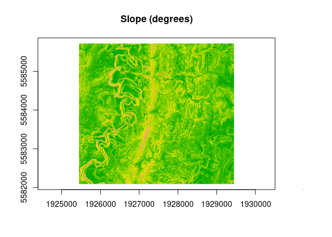

<!-- README.md is generated from README.Rmd. Please edit that file -->

# wbw 

<!-- badges: start -->

[](https://www.repostatus.org/#wip)

[](https://github.com/atsyplenkov/wbw/actions/workflows/R-CMD-check.yaml)
[](https://app.codecov.io/gh/atsyplenkov/wbw)
<!-- badges: end -->

The `{wbw}` R package provides R bindings to the [Whitebox Workflows for
Python](https://www.whiteboxgeo.com/manual/wbw-user-manual/book/preface.html)
— a powerful and fast library for advanced geoprocessing, with focus on
hydrological, geomorphometric and remote sensing analysis of raster,
vector and LiDAR data.

## Do we need Yet Another RSpatial Package?

Well …

## Basic workflow

The `wbw` R package introduces several new S7 classes, `WhiteboxRaster`
and `WhiteboxVector` which serves as a bridge between Python and R.

``` r
library(wbw)

raster_path <- 
  system.file("extdata/dem.tif", package = "wbw")
dem <- wbw_read_raster(raster_path)
dem
#> +------------------------------------------+ 
#> | WhiteboxRaster                           |
#> | dem.tif                                  |
#> |..........................................| 
#> | bands       : 1                          |
#> | dimensions  : 726, 800  (nrow, ncol)     |
#> | resolution  : 5.002392, 5.000243  (x, y) |
#> | EPSG        : 2193  (Linear_Meter)       |
#> | min value   : 63.698193                  |
#> | max value   : 361.020721                 |
#> +------------------------------------------+
```

The true power of the `wbw` unleashes when there’s a need to run several
operations sequentially, i.e. in a pipeline. For example, first DEM
should be smoothed (or filtered), and then the slope should be
estimated.

``` r
slope_deg <-
  dem |>
  wbw_adaptive_filter() |> 
  wbw_slope(units = "d")

plot(slope_deg)
```



## Installation

You can install the development version of wbw from
[GitHub](https://github.com/) with:

``` r
# install.packages("pak")
pak::pak("atsyplenkov/wbw")
```

> \[!TIP\] While the `{wbw}` requires the `whitebox-workflows` Python
> library v1.3.3+. It is designed to install all the dependencies
> automatically.
